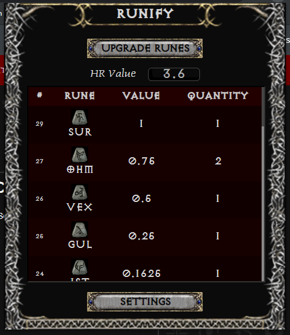
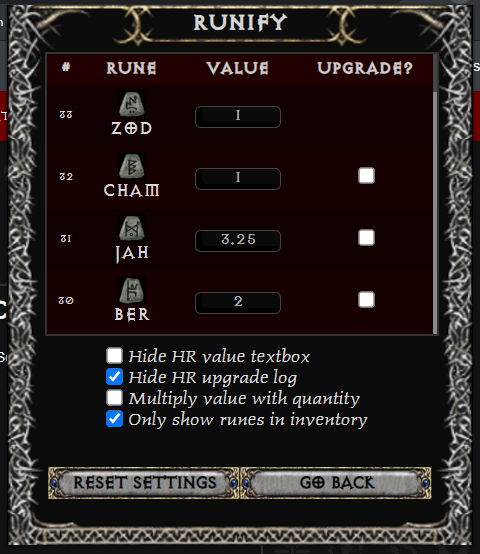

# runify
Displays all runes in your characters inventory with option to upgrade everything possible.

  

Disclaimer: I am self-taught programmer. I don't know how to design. This was just a hobby project and it might not
even be useful for most people. I did this as an exercise to practice JavaScript and wanted to post it in case somebody
out there might find it neat.

It's not yet available as a Chrome Extension but that's the plan if I get permission from Path of Diablo management.
